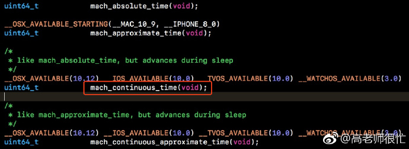
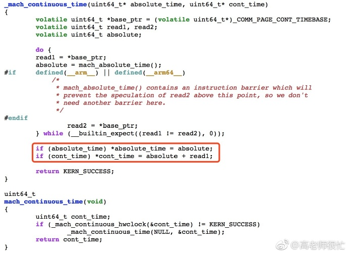
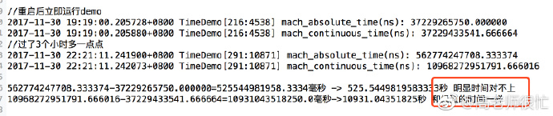
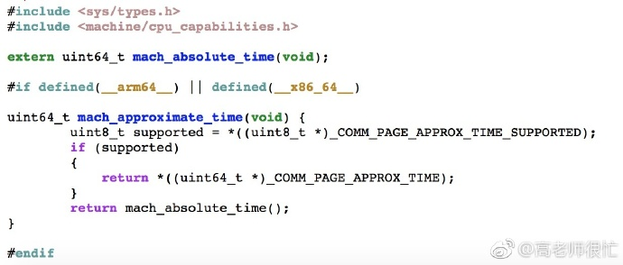

## iOS中的mach\_continuous\_time()方法

**作者**: [高老师很忙](https://weibo.com/517082456)

`mach_absolute_time()` 这个函数大家应该比较了解：返回的是CPU已经运行的时钟周期数，可以转化为秒数，这个是不会受本地时间影响的，不过当手机重启会重新开始计数，锁屏休眠后会暂停计数。今天看文档惊喜的发现了 `iOS10` 之后提供了 `mach_continuous_time()` 方法：

注释写的是：

> like mach_absolute_time, but advances during sleep

突然感觉好惊喜，查看了一下源码：

通过休眠测试（使用 `iPhone8+` , `iOS11` ,删除所有 `APP`, 关掉网络和蓝牙等，先运行 `demo` 获取一个时间，锁屏过了几个小时，再次获取时间)，结果果然可喜：

不过重启后仍然会重置。顺便再介绍一下 `mach_approximate_time()`，是获取一个大约时间，暂时没有用过，可以简单看下源码：

比较好理解。希望能帮助到大家！

