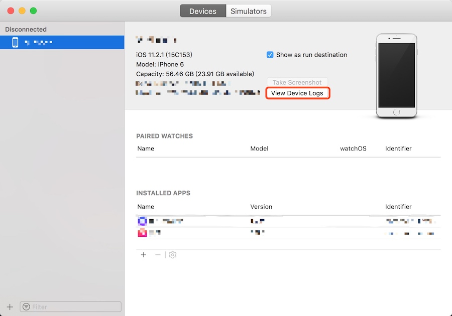
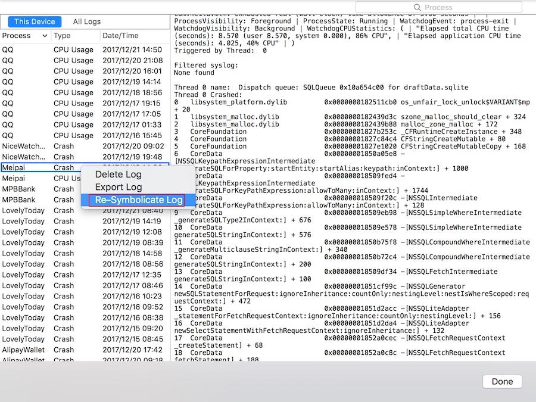

## iOS快速解析崩溃日志

**作者**: [Vong_HUST](https://weibo.com/VongLo)

平时我们拿到一份崩溃日志，需要解析，一般操作是取到对应的 dSYM 和对应的二进制文件，然后拿到相应的崩溃日志 uuid 、二进制的 uuid、dSYM 的 uuid 通过命令行来解析。这些操作感觉比较耗时。下面介绍几种情况下的快速解析的方法：

* 自己设备上 Xcode 编译的包发生闪退：连上手机打开 Xcode，cmd+shift+2 呼出 Device 的 Window，如图1所示，然后点击 View Device Logs，然后选中对应时间段自己 app 的崩溃日志。如果此时对应的调用栈还没有符号化，可以选中日志后右键如图2所示 Re-Symbolicate Log 即可。

2. 如果是打包服务器或者 Appstore 的包发生闪退：拷贝对应的包和 dSYM 到任意文件夹下，注意将 dSYM 解压以及 .ipa 里面的 .app 取出。然后按照情况1的方式处理即可，Xcode 会自动索引二进制及 dSYM。

3. 如果拿到别的设备导出的未符号化的崩溃日志，可以将日志拖至图2所示的列表中，注意此时上面 tab 记得选 All Logs 而不是 This Device，然后参考情况2，找到崩溃日志对应的二进制包和 dSYM 文件，按照情况2处理即可。可能会遇到系统库的一些方法无法符号化的问题，只需要找到对应的设备连上电脑，让 Xcode 读取一遍该设备(同机型和系统版本的也可以)的符号表，然后再 Re-Symbolicate 一遍就行。

4. 遇到线上用户崩溃，无法拿到完整崩溃日志，可以让用户到【设置->分析->分析数据】里面找到对应时间点的崩溃日志，然后截图，根据一个开源工具 [dSYMTools](https://github.com/answer-huang/dSYMTools)，把崩溃栈的关键地址输入到文本框中即可解析出崩溃的那个方法，具体使用方法参考 [ReadMe](https://github.com/answer-huang/dSYMTools)。

