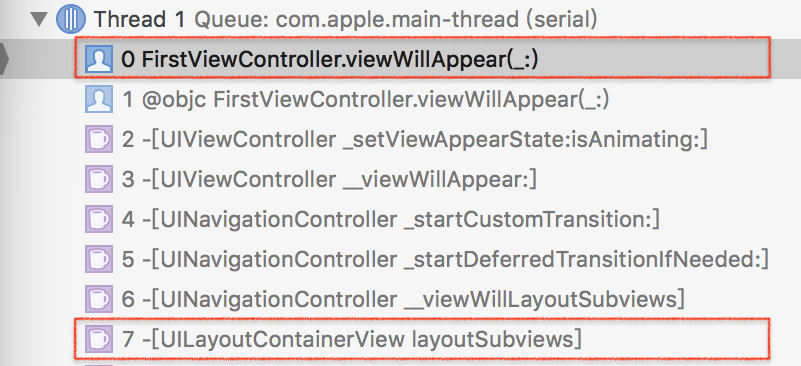

## iOS 处理 navigationBar.titleTextAttributes 属性时机

**作者**: [无彦主](https://weibo.com/u/2629799120)

笔者一般在 ViewController 的 viewWillAppear 中处理导航条的 UI 变化。比如是否隐藏导航栏、改变状态栏颜色等。但是最近发现在 viewWillAppear 中改变 navigationBar 的 `titleTextAttributes` 属性却在 pop 时出现了问题：「 从 SecondViewController 点击导航栏返回到 FirstViewController 时并没有生效，而使用滑动手势返回却可以生效。」

```swift
import UIKit

class FirstViewController: UIViewController {
    ...
    override func viewWillAppear(_ animated: Bool) {
        super.viewWillAppear(animated)

        navigationController?.setNavgationBarTitleTextAttributes(
            color: .nav_purple,
            font:  .nav_regular
        )
    }
    ...
}
```

### 原因

在 iOS 系统 10 以后，UIKit 已经更新，统一后台管理 UINavigationBar，UITabBar 和 UIToolbar。特别是，对这些视图的背景属性（例如背景或阴影图像或设置条形样式）的更改可能会启动条形码的布局传递以解析新的背景外观。特别地，这意味着，试图改变的内部这些条的背景外观 

```objc
layoutSubviews， 
-[UIView updateConstraints] ，
viewWillLayoutSubviews，
viewDidLayoutSubviews，
updateViewConstraints
```
或响应布局而调用的任何其他方法都可能导致布局循环。布局更改调用的 viewWillAppear 似乎触发了所提到的布局循环。



### 处理

比较简单的处理方法是在 SecondViewController 中重写 `willMove(:)` 方法，在这里将 titleAttribute 赋值回去，但这样的方式不够彻底，它显然不能处理两种或两种以上的状态变化。更为稳妥的的方法是重写自定义 UINavigationController 中的 `popViewController(:)` 方法。

```swift
// NavBarTitleChangeable.swift

import UIKit

public protocol NavBarTitleChangeable: class {
    var preferrdTextAttributes: [NSAttributedStringKey: AnyObject] { get }
}

...
```

```swift
// Custom UINavigationController

import UIKit

class FunNavigationViewController: UINavigationController {

    private var topViewControllerNavBarTitleAttributes: [NSAttributedStringKey: AnyObject]? {
        return (topViewController as? NavBarTitleChangeable)?.preferrdTextAttributes
    }

    private func setNavBarTitleAttributes(_ attributes: [NSAttributedStringKey: AnyObject]) {
        navigationBar.titleTextAttributes = attributes
    }

    override func viewDidLoad() {
        super.viewDidLoad()
        if let attributes = topViewControllerNavBarTitleAttributes {
            setNavBarTitleAttributes(attributes)
        }
    }

    override func pushViewController(_ viewController: UIViewController, animated: Bool) {
        super.pushViewController(viewController, animated: animated)

        if let attributes = topViewControllerNavBarTitleAttributes {
            setNavBarTitleAttributes(attributes)
        }
    }

    override func popViewController(animated: Bool) -> UIViewController? {
        let popViewController = super.popViewController(animated: animated)

        if let attributes = topViewControllerNavBarTitleAttributes {
            setNavBarTitleAttributes(attributes)
        }
        transitionCoordinator?.animate(alongsideTransition: nil) { [weak self] _ in
            if let attributes = self?.topViewControllerNavBarTitleAttributes {
                self?.setNavBarTitleAttributes(attributes)
            }
        }
        return popViewController
    }
}
```

### 使用

```swift
// MyViewController.swift

import UIKit

class FirstViewController: UIViewController, NavBarTitleChangeable {

    var preferrdTextAttributes: [NSAttributedStringKey : AnyObject] {
        let item = FunNavTitleTextAttributesItem(color: .nav_purple, font:  .nav_regular)
        return getNavgationBarTitleTextAttributes(with: item)
    }

    ...
}
```

这里简单展示处理思路，具体代码还是要根据项目需求定制。

[Demo](https://github.com/wiiale/NavgationTitlePoppingDemo/tree/master)

### 参考
* [iOS 10 SDK Release Notes](https://developer.apple.com/library/content/releasenotes/General/RN-iOSSDK-10.0/index.html#//apple_ref/doc/uid/TP40017540-CH1-SW1)  
* [stackoverflow](https://stackoverflow.com/questions/39511088/navigationbar-coloring-in-viewwillappear-happens-too-late-in-ios-10)


