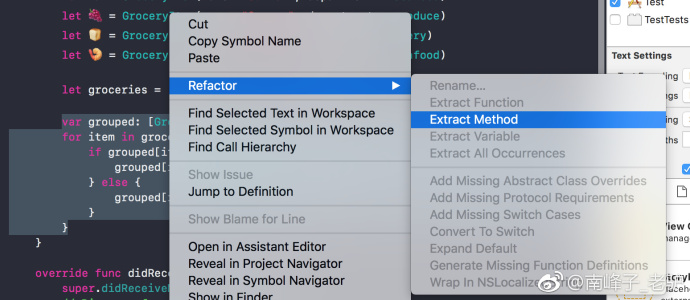
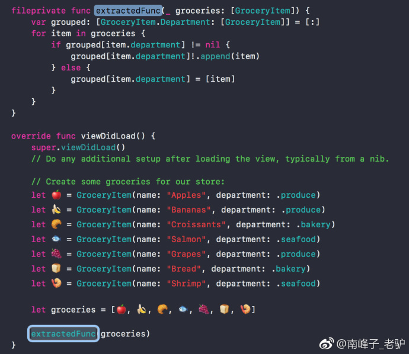

## Extract Function/Extract Method

**作者**: [南峰子](https://weibo.com/touristdiary)

当我们写代码写得飞起的时候，很可能在一个函数/方法里面堆积大量代码。当然，从美学的角度来讲，我们更希望写一些小而职责单一的函数/方法，所以这时候可以考虑重构。

Xcode 为我们提供了一个简便的方法：`Extract Function/Extract Method`，来将代码提取成一个函数/方法。

具体操作是：首先选中要提取的代码，然后右键点击出现菜单，选择`Refactor` -> `Extract Function/Extract Method`，如下图所示：

可以看到选中的代码被提取成一个单独的方法，我们可以给方法命个名，如下图所示：

而且这个操作可以识别新方法需要哪些参数，是不是很方便？

